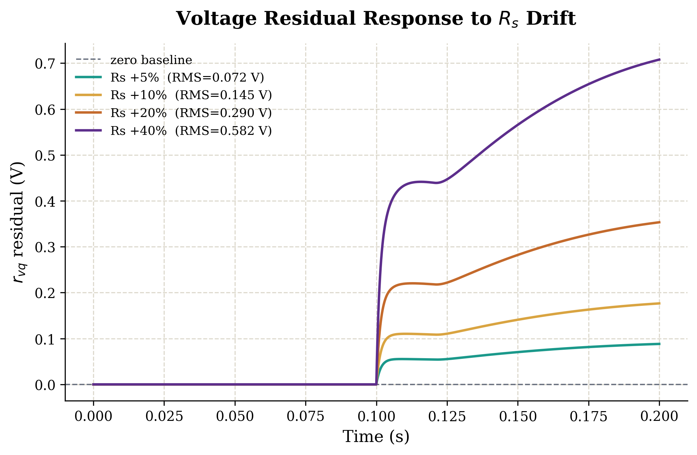
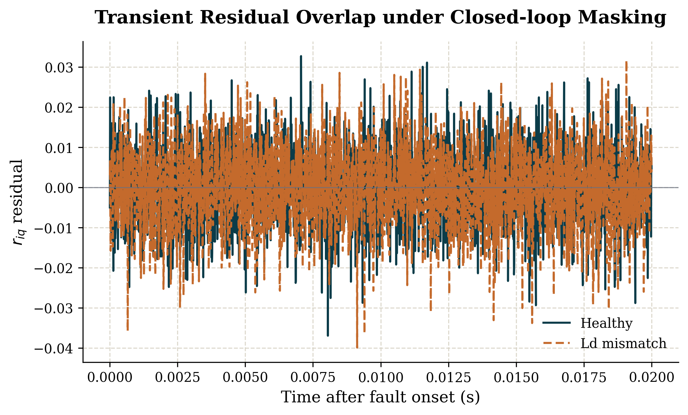

# Simulation-Based Digital Twin of PMSM Drive for AI-Assisted Fault Diagnosis

This repository contains the Python implementation of a simulation-based digital twin framework for health monitoring and fault diagnosis of a Permanent Magnet Synchronous Motor (PMSM) drive operating under closed-loop Field-Oriented Control (FOC).

The project was developed as a B.Sc. Mechatronics Engineering capstone project. The framework compares a faulty PMSM plant with a nominal healthy digital twin model under the same control inputs. The difference between the two responses is used to generate residual signals for fault detection, feature extraction, and machine learning-based fault classification.

## Project Overview

The main objective of this project is to investigate whether parameter faults in a closed-loop PMSM drive can be detected and classified using a digital twin-based residual monitoring approach.

The framework focuses on:

- PMSM dq-axis simulation
- Closed-loop Field-Oriented Control
- Parallel nominal digital twin model
- Residual signal generation
- Residual energy-based detection
- Transient feature-based detection
- Machine learning-based fault classification
- Closed-loop masking effect analysis

## Fault Conditions

The following operating conditions are considered:

- Healthy operation
- Stator resistance drift
- d-axis inductance mismatch

Stator resistance drift produced a clear and sustained residual response, while d-axis inductance mismatch showed more challenging behavior because of partial compensation by the closed-loop controller. This closed-loop masking effect is one of the key findings of the project.

## Repository Structure

```text
.
├── main.py
├── train_model.py
├── test_gate_phase32.py
├── controllers/
│   └── pi.py
├── models/
│   └── pmsm.py
├── utils/
│   ├── energy_gate.py
│   ├── peak_gate.py
│   └── transient_feature_gate.py
├── figures/
├── data/
├── requirements.txt
├── LICENSE
└── README.md
```

## Installation

Clone the repository:

```bash
git clone https://github.com/nini-n/pmsm-digital-twin-fault-diagnosis.git
cd pmsm-digital-twin-fault-diagnosis
```

Install the required packages:

```bash
pip install -r requirements.txt
```

## Usage

Generate the simulation dataset:

```bash
python main.py
```

Train and evaluate the machine learning model:

```bash
python train_model.py
```

Run the residual-energy and transient gate detection test:

```bash
python test_gate_phase32.py
```

Generate selected thesis figures:

```bash
python plot_rs_residual_sweep.py
python plot_detection_statistics.py
python plot_masking_effect.py
```

## Method Summary

The simulation runs two PMSM models in parallel:

1. A faulty PMSM plant, where selected parameter faults are introduced after a predefined fault onset time.
2. A nominal PMSM digital twin, which keeps the healthy parameter values unchanged.

Both models receive the same control inputs. Residual signals are calculated as the difference between the measured faulty plant response and the nominal digital twin response. These residuals are then used for detection and classification.

## Main Results

The developed framework achieved approximately 94% classification accuracy for the tested simulation scenarios. Stator resistance drift was classified clearly, while the main difficulty occurred between healthy operation and d-axis inductance mismatch. This behavior was linked to the closed-loop masking effect caused by the FOC controller.

The figures below show two representative results from the simulation study.

### Residual Response under Stator Resistance Drift



### Closed-Loop Masking Effect for d-Axis Inductance Mismatch



## Notes

This project is simulation-based and does not include physical PMSM hardware validation. The framework is intended as a research prototype for digital twin-based PMSM fault monitoring and can be extended with real experimental data, additional fault types, and more advanced observer-based detection methods.

## License

This project is licensed under the MIT License.
